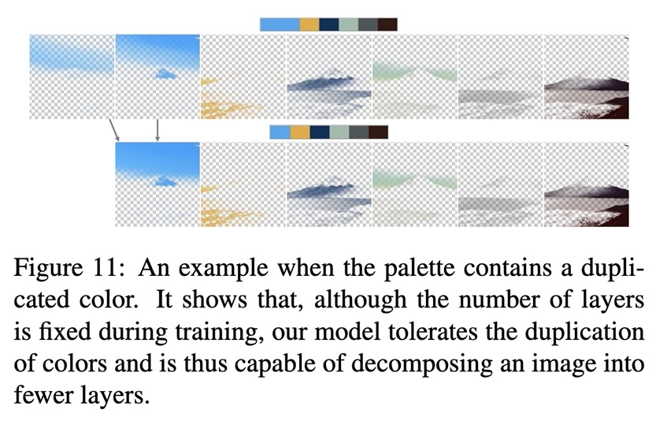

# Decompose

[Fast Soft Color Segmentation](https://github.com/pfnet-research/FSCS) without `Residue predictor`.
[Paper PDF](https://arxiv.org/pdf/2004.08096.pdf)

The model only supports 7 colors. The same color can be repeated for less color.



```bash
pip install git+https://github.com/setanarut/decompose 
```

## Example

```python

from decompose.decomposer import decompose
from PIL import Image

img = Image.open("image.jpg")
layers = decompose(img)

for layer in layers:
    print(layer)

# Decomposer mask generation...
# Decomposer processing alpha layers...
# Decomposer Done!
# <PIL.Image.Image image mode=RGBA size=904x368 at 0x1144F71D0>
# <PIL.Image.Image image mode=RGBA size=904x368 at 0x111EA4A90>
# <PIL.Image.Image image mode=RGBA size=904x368 at 0x114585510>
# <PIL.Image.Image image mode=RGBA size=904x368 at 0x114587790>
# <PIL.Image.Image image mode=RGBA size=904x368 at 0x1145856D0>
# <PIL.Image.Image image mode=RGBA size=904x368 at 0x1145858D0>
# <PIL.Image.Image image mode=RGBA size=904x368 at 0x114585C90>
```

## decomp command-line tool example

Saves layers as ORA (Open Raster) file. It can be opened with Krita. Also saves the palette.

```bash
$ decomp ~/Desktop/img.png

# Decomposer mask generation...
# Decomposer processing alpha layers...
# Decomposer Done!
# ORA saved: img.ora
# 7
# Palette saved: img_palette.png
```
